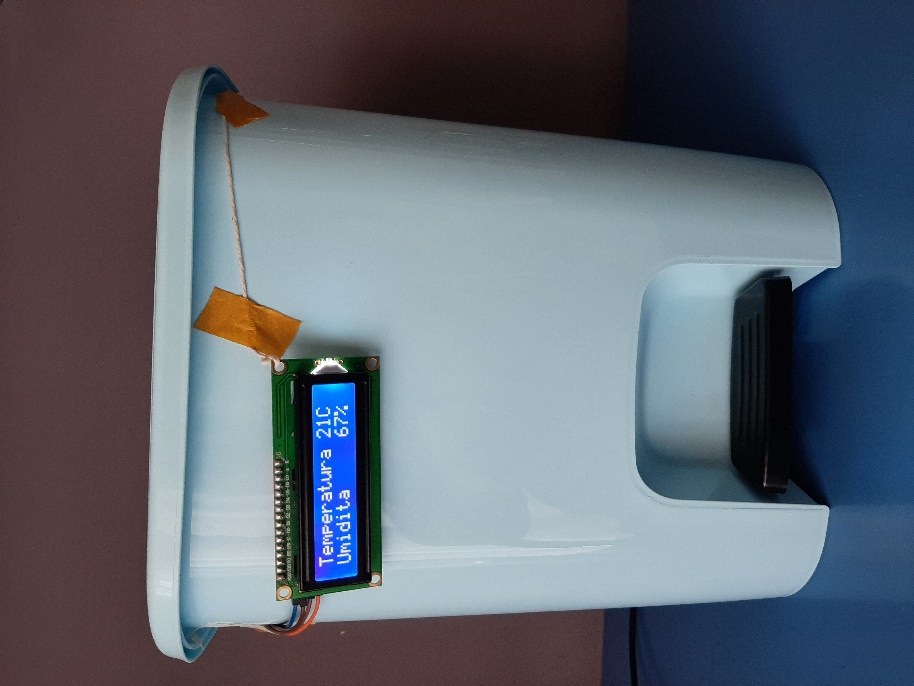
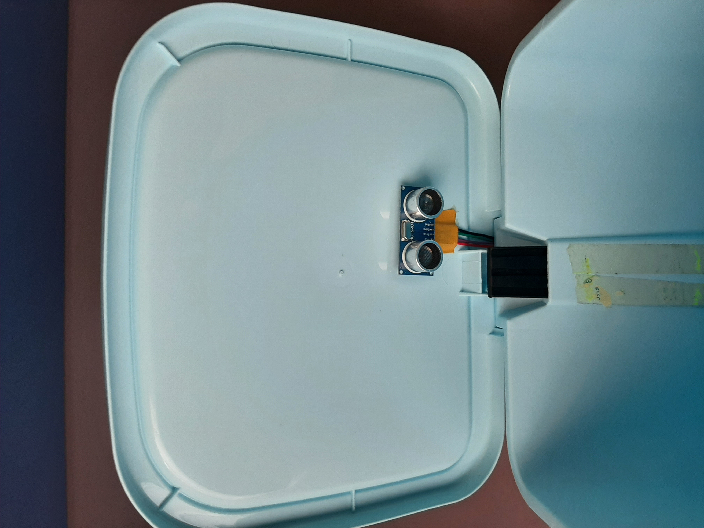
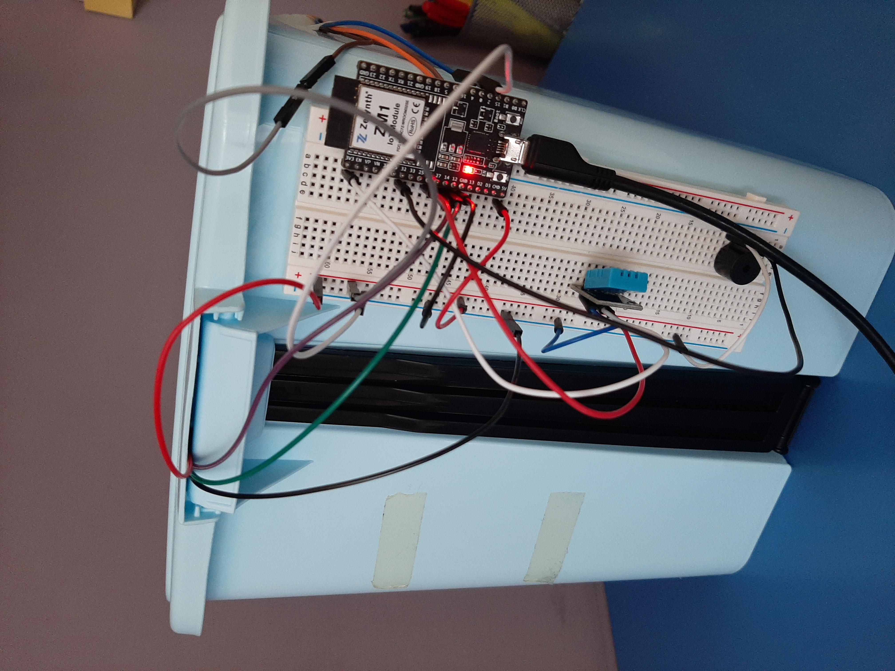

# IoT-Bin
### Descrizione
L’idea del progetto è nata dall‘intenzione di migliorare la gestione della 
raccolta dei rifiuti in luoghi turistici. In tali aree, il controllo dei rifiuti risulta essere troppo basso o 
addirittura inesistente.  Il prototipo in questione è un bidone della spazzatura che fornisce dati 
come il livello dei rifiuti e dati meteorologici quali temperatura e 
umidità, recuperabili dalla rete. L'obiettivo principale è che quando il livello di riempimento del cestino 
è massimo, questo invii una notifica ai netturbini incaricati dello 
svuotamento.Così il luogo rimarrà in condizioni ottimali per la flora, la 
fauna e i visitatori
### Funzionalità
- Gestione di allarmi con notifiche per il raggiungimento della capienza 
massima 
- Gestione di allarmi con notifiche per valori critici di umidità o 
temperatura
 - Visualizzazione dei dati misurati
 - Allarme acustico in caso di pericolo incendio del bidone

